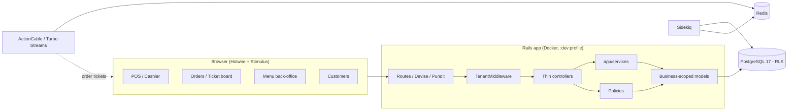
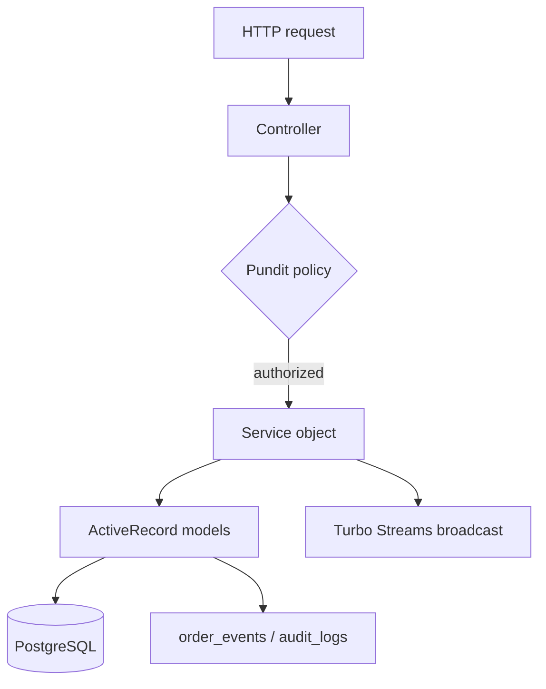
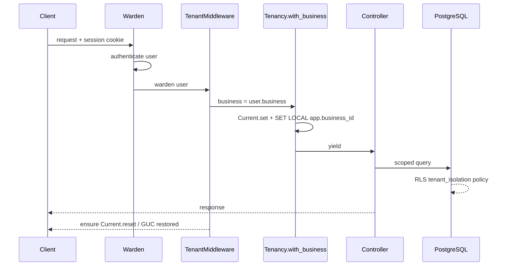
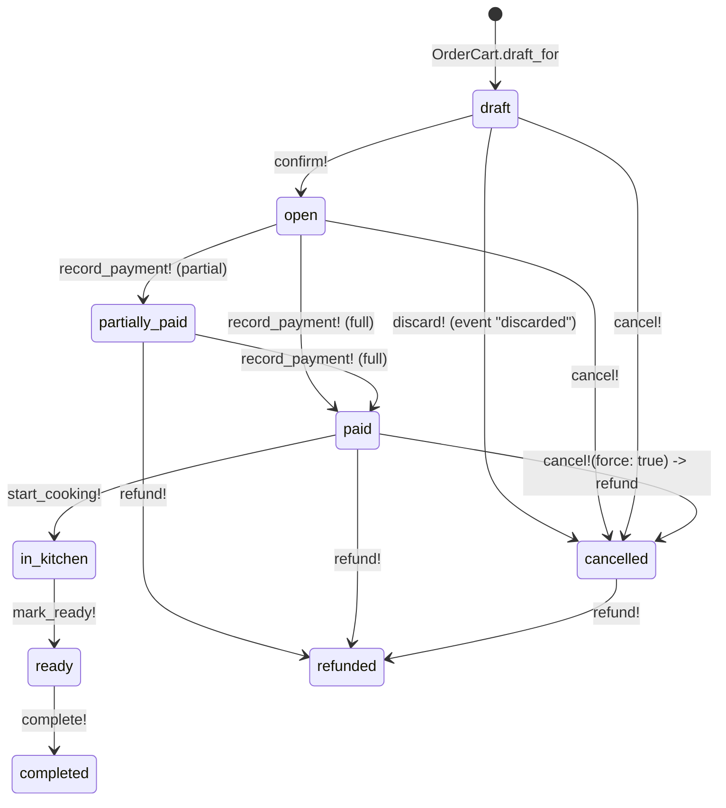

# Architecture

This document describes the FoodTruck Ops platform as implemented on `main`
(M1: auth, menu, POS/orders/payments, customers, tenancy, audit). It is the
reference for how the pieces fit together; module-level details live in
`MODULES/` and the tenancy internals in TENANCY.md.

## Overview

A Rails 8 monolith, developed **Docker-only** (Ruby is never installed on the
host), running PostgreSQL with Row-Level Security as the multi-tenant
backstop. The UI is server-rendered Hotwire (Turbo + Stimulus + Tailwind) with
real-time order updates over ActionCable/Turbo Streams. Everything is in
Brazilian Portuguese (`pt-BR`), money is BRL, and dates/times render in the
business timezone.



## Tech stack

| Concern | Choice |
|---------|--------|
| Framework | Rails 8.1 (`ruby-3.4.10`) |
| Database | PostgreSQL 17, schema format `:sql` |
| Multi-tenancy | `BusinessScoped` concern + GUC `SET LOCAL app.business_id` + Postgres RLS |
| Auth | Devise (database/validatable/timeoutable/lockable/trackable), session-based |
| AuthZ | Pundit |
| Background jobs | Sidekiq (with tenancy middleware) |
| Real-time | ActionCable + Turbo Streams |
| Frontend | Hotwire (Turbo/Stimulus), Tailwind, Propshaft |
| Storage | ActiveStorage, local disk |
| i18n | `pt-BR` default (`rails-i18n`), helpers `format_money`/`format_date`/`format_datetime` |
| CI | RuboCop, Brakeman, RSpec + SimpleCov ≥95% (`bin/ci`, `.github/workflows/ci.yml`) |

## Layering

Controllers stay thin. Business logic lives in `app/services/`, authorization
in Pundit policies, and domain rules on the models themselves.



- **Services** (`app/services/`): `OrderCart` (draft cart editing),
  `OrderLifecycle` (all status transitions, validated + audited + broadcast),
  `MenuQuery` (tenant-aware cached menu), `CustomerHistory` (purchase history).
- **Policies** (`app/policies/`): one per resource; `MenuRecordPolicy` is
  shared by the menu CRUD resources. See the role matrix below.
- **Models**: `BusinessScoped` for tenancy, `SoftDelete` (`discarded_at`),
  `TenantChild` (parent-must-be-same-business validation),
  `MenuInvalidatable` (bumps `businesses.menu_version` on menu writes).

## Request lifecycle

1. Warden (Devise) authenticates the user from the session.
2. `TenantMiddleware` (inserted after `Warden::Manager`) resolves the business
   (`Current.business || user.business`) and wraps the request in
   `Tenancy.with_business`, which sets `Current.business` and
   `SET LOCAL app.business_id` in a transaction.
3. The controller authorizes the action with Pundit (`after_action
   :verify_authorized`).
4. The service/model reads/writes rows; RLS and `BusinessScoped` keep every
   query inside the tenant.
5. Writes that matter are recorded on the immutable `order_events` timeline and
   broadcast to the business's Turbo Streams channel so ticket boards update
   live.



## Auth & authorization

- **Devise** handles sign-in at `/users/sign_in`. `Users::SessionsController`
  resolves the candidate business by email first, then authenticates inside
  `Tenancy.with_business` so audit events land in the right tenant.
- Sign-in/out/lock events are written to `audit_logs` (`config/initializers/auth_audit.rb`).
- **Roles** (`users.role`): `owner`, `cashier`, `kitchen`. Capabilities:

| Surface | owner | cashier | kitchen |
|---------|:---:|:---:|:---:|
| POS (create/update/pay orders) | ✓ | ✓ | ✗ |
| Orders view | ✓ | ✓ | ✓ |
| Cancel unpaid order | ✓ | ✓ | ✗ |
| Cancel order in kitchen/paid/ready | ✓ | ✗ | ✗ |
| Refund | ✓ | ✓ | ✗ |
| Customers view / create / update | ✓ | ✓ | ✗ |
| Customers archive (destroy) | ✓ | ✗ | ✗ |
| Menu CRUD | ✓ | ✗ | ✗ |
| Users & settings | ✓ | ✗ | ✗ |

## Order lifecycle (POS)

The order state machine is pinned in `Order` (enum) and transitions are driven
**only** by `OrderLifecycle`, which validates the move, appends an
`order_events` row with the actor, and broadcasts the ticket.



- **Cart**: `OrderCart` snapshots product/variant/add-on names and prices at
  sale time, merges duplicate lines, refuses edits after the order leaves
  `draft`, and refuses products/customers from another business.
- **Totals**: recomputed from line items (`recalculate_totals!`), always
  `total == subtotal + tax`; `payment_status` is derived from successful
  payments vs `total` (`fully_paid?`, `balance_due`).
- **Payments**: `method` ∈ `cash | pix | card`, `status` ∈ `succeeded |
  refunded`. A payment cannot exceed the outstanding balance.
- **Concurrency**: `lock_version` optimistic locking on `orders`; cashiers
  racing on the same ticket are detected.

## Real-time

- `OrderChannel` streams from `"orders_<business_id>"`; `OrderLifecycle`
  broadcasts `Turbo::StreamsChannel.broadcast_replace_to` (ticket partial) on
  every transition so all open ticket boards stay in sync.
- Order ticket board and POS live in the same session store per business.

## Directory map

```text
app/
  channels/            ActionCable (OrderChannel)
  controllers/         thin controllers; users/sessions (Devise)
  helpers/             format_money / format_date / format_datetime
  jobs/                ApplicationJob, BusinessJob (tenant-aware)
  middleware/          tenant_middleware.rb
  models/              Business, User, Category, Product, Variant, Addon,
                       Order, OrderItem, OrderItemAddon, Payment, OrderEvent,
                       Customer, AuditLog
  models/concerns/     BusinessScoped, SoftDelete, TenantChild, MenuInvalidatable
  policies/            Pundit policies (one per resource)
  services/            OrderCart, OrderLifecycle, MenuQuery, CustomerHistory
  views/               Hotwire views, partials, Turbo streams
lib/
  generators/tenant_model   rails generate tenant_model <Name>
  tasks/tenancy.rake        tenancy:console[business_id]
  tenancy.rb                Tenancy.with_business
  tenancy/sidekiq_*.rb      job tenancy middleware
config/
  routes.rb                 /up, devise, menu, pos, orders, customers, catalog
  application.rb            pt-BR, TenantMiddleware, schema_format :sql
bin/                        setup, ci, db-prepare, rubocop, brakeman, bundler-audit
docker/                     postgres/init-app-role.sql (app role bootstrap)
```

## Planned modules (separate branches)

These are part of the M1 roadmap but **not merged to `main`** yet:

| Module | Branch | Status |
|--------|--------|--------|
| Kitchen Display System | `t6-kitchen-display` | in progress |
| Cash register & movements | `t7-cash-register` | in progress |
| Daily report | `t10-daily-report` | in progress |
| JSON API (JSON:API) + Swagger | `t11-json-api` | in progress |
| Integration adapters (`app/integrations`, mocks) | `t12-mock-adapters` | in progress |
| Delivery management | `t13-delivery` | in progress |

New modules should follow the existing layering: controller → policy → service
→ `BusinessScoped` model, with RLS-covered tables and `order_events`-style
audit timelines where state changes.
