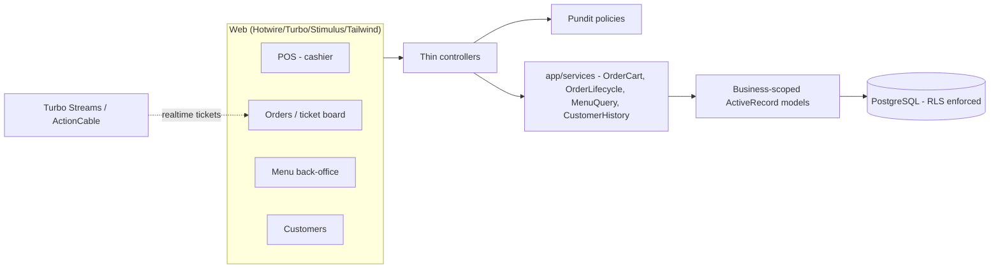

# Development — Architecture, Tenancy & Conventions

This guide covers how the platform is structured and the conventions every
contribution must follow. For the database shape see ERD.md, for the tenancy
mechanism in depth see TENANCY.md, and for the component map see
ARCHITECTURE.md.

## Architecture overview

Rails 8 monolith with a layered controller → service/policy → model
structure. Tenancy is enforced by the `BusinessScoped` concern in every model
plus Postgres RLS; no controller-level scoping is needed.



**Conventions:**

- Controllers stay thin; business logic lives in services, query objects and
  policies. Every controller action calls `authorize` (Pundit).
- Every tenant-scoped model includes `BusinessScoped`; child rows validate
  their parents via `TenantChild#validates_parent_business_for`.
- State changes go through a service (e.g. `OrderLifecycle`) so they are
  validated, audited (`order_events`/`audit_logs`) and broadcast consistently.
- Soft deletes use the `SoftDelete` concern (`discarded_at`); hard `destroy!`
  is reserved for append-only or technical tables.

## Tenancy layer

Three cooperating mechanisms (full detail in TENANCY.md):

1. **Application scope** — `BusinessScoped` default-scopes every query to
   `Current.business_id!` and assigns `business_id` on create.
2. **Context propagation** — `Tenancy.with_business` sets `Current.business`
   and `SET LOCAL app.business_id` inside a transaction. Entry points: HTTP
   (`TenantMiddleware` after Warden), Sidekiq (client/server middleware),
   ActionCable (`Connection#connect`), and the `tenancy:console` rake task.
3. **Database backstop** — tenant tables have `FORCE ROW LEVEL SECURITY`, a
   `tenant_isolation` policy on the GUC, and a `BEFORE INSERT` trigger that
   fills `business_id` from the GUC. The app connects as the `NOBYPASSRLS`
   `app` role; `users` is the deliberate RLS exception (auth needs unscoped
   lookups).

New tenant-scoped models are generated with:

```bash
bin/rails generate tenant_model <Name>
```

## Multi-tenancy verification

Run as the `app` role from the `db` container. Note: `users` is **not** under
RLS, so use an RLS-covered table (e.g. `orders`) for these checks:

```sh
# no GUC  -> hard error (never a silent empty read)
docker compose exec db psql -U app -d foodtruck_ops_development -c \
  "SELECT COUNT(*) FROM orders;"

# wrong GUC -> zero rows
docker compose exec db psql -U app -d foodtruck_ops_development -c \
  "SET app.business_id='00000000-0000-0000-0000-000000000000'; SELECT COUNT(*) FROM orders;"

# right GUC -> own rows only
docker compose exec db psql -U app -d foodtruck_ops_development -c \
  "SET app.business_id='<business-uuid>'; SELECT COUNT(*) FROM orders;"
```

## Code style

- **Language:** Portuguese (pt-BR) for all user-facing strings via
  `I18n.t` keys in `config/locales/*.pt-BR.yml` — no hardcoded English in
  views. Default locale is `pt-BR` (`config/application.rb`).
- **Money:** `decimal(12,2)` BRL, never float. Totals are recomputed from line
  items; line items snapshot names/prices at sale time. Use the
  `format_money`, `format_date`, `format_datetime` helpers.
- **Time:** dates/times render in the business timezone
  (`businesses.timezone`, default `America/Sao_Paulo`).
- **Testing:** RSpec + FactoryBot + SimpleCov **≥95%** line-coverage floor
  enforced by `bin/ci`. Every feature ships with specs and docs.
- **Linting:** RuboCop + Brakeman in `bin/ci`. No TODOs/FIXMEs in shipped code.

## Services layer

Directory: `app/services/`.

| Service | Responsibility |
|---------|----------------|
| `OrderCart` | Builds/edits a draft order's cart; snapshots names/prices; refuses edits once confirmed; enforces same-business products/customers |
| `OrderLifecycle` | The only allowed driver of order status transitions; validates, records `order_events`, broadcasts Turbo updates |
| `MenuQuery` | POS-facing menu grouped by active category; tenant-aware `Rails.cache` key includes `business.menu_version` |
| `CustomerHistory` | Purchase history/totals for a customer from `Order.purchases` |

Example — a cache-aware query object:

```ruby
MenuQuery.call(business: Current.business, query: params[:q])
```

## Testing & data

- Test database: `foodtruck_ops_test` (same schema). `bin/ci` prepares it as
  the migration-owner then runs the suite as `app`.
- FactoryBot factories live in `spec/factories/`.
- `db/seeds.rb` (idempotent) creates the `FoodTruck Ops` business and
  owner/cashier/kitchen users; run it via `bin/db-prepare`.

## CLI & tasks

```bash
bin/setup                       # full dev loop (see SETUP.md)
bin/ci                          # rubocop + brakeman + rspec + coverage
bin/db-prepare                  # rails db:prepare + grant app privileges
bin/rails "tenancy:console[<business-id>]"   # tenant-bound console
bin/rails generate tenant_model <Name>       # new tenant-scoped model
docker compose logs -f web worker tailwind
```

## Planned modules (not on `main`)

KDS, cash register, daily report, JSON API (JSON:API) + Swagger, integration
adapters (`app/integrations` + mocks, selected per business), and delivery are
being built on feature branches and will extend this platform. Until merged,
do not document them as present here — see the branch/ticket for their status.
