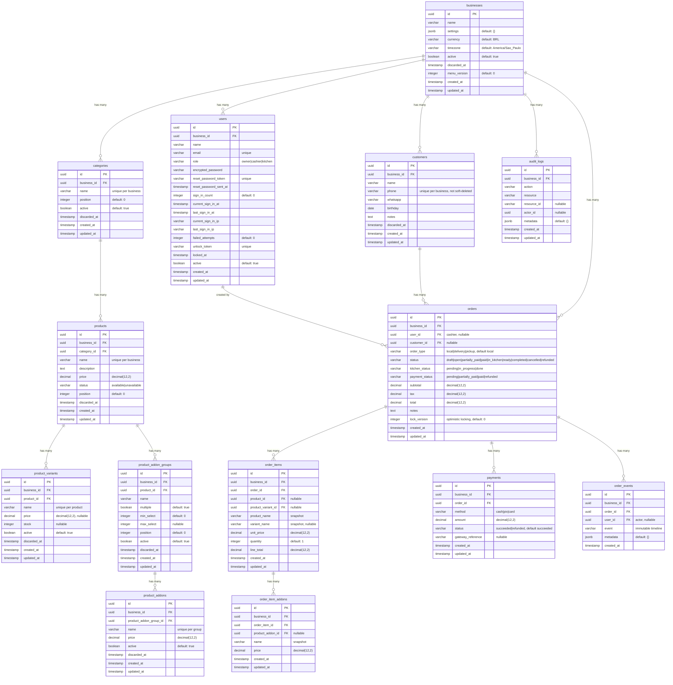

# Entity Relationship Diagram

The schema below is generated from the actual `db/structure.sql` (the project
uses `config.active_record.schema_format = :sql`). Tenant-scoped tables carry a
`business_id uuid NOT NULL` foreign key to `businesses`, `FORCE ROW LEVEL
SECURITY`, a `tenant_isolation` policy, and a `BEFORE INSERT` trigger that fills
`business_id` from the `app.business_id` GUC. See TENANCY.md for how the layers
interact.

## Entities

## RLS / soft-delete matrix

| Table            | `business_id` | RLS (FORCE + policy) | Soft delete | Notes |
|------------------|:---:|:---:|:---:|-------|
| `businesses`     | —   | No  | Yes | tenant root |
| `users`          | Yes | **No** | No  | scoped in-app only; auth needs `unscoped` lookups |
| `categories`     | Yes | Yes | Yes | |
| `products`       | Yes | Yes | Yes | |
| `product_variants` | Yes | Yes | Yes | |
| `product_addon_groups` | Yes | Yes | Yes | |
| `product_addons` | Yes | Yes | Yes | |
| `customers`      | Yes | Yes | Yes | |
| `orders`         | Yes | Yes | No  | |
| `order_items`    | Yes | Yes | No  | |
| `order_item_addons` | Yes | Yes | No | |
| `payments`       | Yes | Yes | No  | |
| `order_events`   | Yes | Yes | No  | immutable timeline |
| `audit_logs`     | Yes | Yes | No  | append-only |

Soft delete is implemented by the `SoftDelete` concern (`discarded_at` +
`default_scope`); discarded rows are excluded unless queried with `with_discarded`.

## Indexes

- `businesses`: `id` PK.
- `users`: unique `email`, unique `reset_password_token`, unique `unlock_token`,
  `business_id`.
- `categories`: unique `(business_id, name)`, `(business_id, position)`.
- `products`: unique `(business_id, name)`, `(category_id, position)`,
  `business_id`, `category_id`.
- `product_variants`: unique `(product_id, name)`, `business_id`, `product_id`.
- `product_addon_groups`: unique `product_id`+`position`, `business_id`,
  `product_id`.
- `product_addons`: unique `(product_addon_group_id, name)`, `business_id`,
  `product_addon_group_id`.
- `customers`: unique `(business_id, phone) WHERE phone IS NOT NULL AND
  discarded_at IS NULL`, `(business_id, name)`, `business_id`.
- `orders`: `business_id`, `(business_id, created_at)`, `(business_id, status)`,
  `(business_id, customer_id)`, `(business_id, user_id)`, `user_id`,
  `customer_id`.
- `order_items`: `business_id`, `order_id`, `(order_id, product_id)`,
  `product_id`, `product_variant_id`.
- `order_item_addons`: `business_id`, `order_item_id`, `product_addon_id`.
- `payments`: `business_id`, `order_id`.
- `order_events`: `business_id`, `order_id`, `(order_id, created_at)`, `user_id`.
- `audit_logs`: `business_id`, `(business_id, created_at)`, `action`.

## Constraints (CHECK)

- `orders`: `subtotal >= 0`, `tax >= 0`, `total >= 0`
- `order_items`: `quantity > 0`, `unit_price >= 0`, `line_total >= 0`
- `order_item_addons`: `price >= 0`
- `payments`: `amount >= 0`
- `products`: `price >= 0`
- `product_variants`: `price IS NULL OR price >= 0`
- `product_addons`: `price >= 0`
- `users`: `role IN ('owner','cashier','kitchen')`

Application-level validations additionally keep totals consistent
(`Order#recalculate_totals!` recomputes `subtotal`/`total` from line items and
add-ons, `total == subtotal + tax`) and payments from exceeding the order
balance (`Payment#cannot_exceed_order_balance`).

## ActiveStorage

`active_storage_attachments`, `active_storage_blobs` and
`active_storage_variant_records` are standard Rails tables (integer PKs) used
for product images (`Product.has_one_attached :image`).

## Migration versions

Schema migrations are recorded in `schema_migrations`; the full list is in
`db/structure.sql`. Notable migrations in the merged M1 history: multi-tenant
RLS foundation, Devise users, menu (categories/products/variants/add-ons),
orders/payments/events, and the customer registry.
