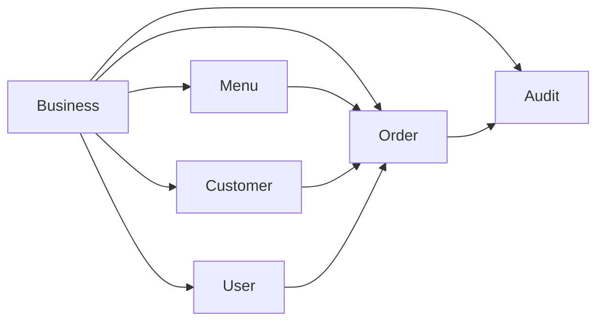

# Module Documentation

Per-module reference for the FoodTruck Ops platform. Each module documents its
models, services, and usage patterns as implemented on `main`.

## Modules

| Module | Status | Doc |
|--------|--------|-----|
| Business | merged | [business.md](business.md) |
| User | merged | [user.md](user.md) |
| Menu | merged | [menu.md](menu.md) |
| Order | merged | [order.md](order.md) |
| Customer | merged | [customer.md](customer.md) |
| Audit | merged | [audit.md](audit.md) |
| Integration | **planned** (T11, `t12-mock-adapters`) | [integration.md](integration.md) |
| CashRegister | **planned** (T7, `t7-cash-register`) | [cash_register.md](cash_register.md) |

Planned modules are documented here as design intent only; nothing about them
exists on `main`. Check the branch/ticket for live progress.

## Module dependencies

## Adding a new module

1. Create a tenant-scoped models via `bin/rails generate tenant_model <Name>`.
2. Add controllers + policies (thin, Pundit-authorized) and services for
   business logic.
3. Document it in a new `MODULES/<name>.md` and link it from this index.
4. Ship it with specs, `bin/ci` green, and `bin/ci` coverage ≥95%.
