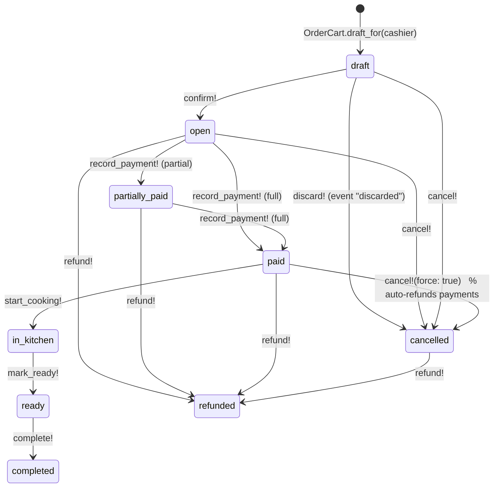

# Order Module

The order is the root of a sale: line items with price snapshots, payments,
and an immutable `order_events` timeline. Every status transition is driven by
`OrderLifecycle`, so each move is validated, audited and broadcast.

## Purpose

- Draft cart editing (add/update/remove lines, attach customer)
- Confirm → collect payment → kitchen → ready → complete
- Payments by `cash`, `pix` or `card`
- Audit timeline (`order_events`) and live ticket updates (Turbo Streams)

## Key models

### Order (app/models/order.rb)

- `order_type`: `local` | `delivery` | `pickup` (default `local`)
- `status` (enum, default `draft`): `draft`, `open`, `partially_paid`, `paid`,
  `in_kitchen`, `ready`, `completed`, `cancelled`, `refunded`
- `kitchen_status`: `pending` | `in_progress` | `done`
- `payment_status`: `pending` | `partially_paid` | `paid` | `refunded`
- Money: `subtotal`, `tax`, `total` (`decimal(12,2)`, `total == subtotal + tax`)
- `lock_version` — optimistic locking for concurrent cashier updates
- Belongs to: `business`, `user` (cashier, optional), `customer` (optional)
- Has many: `order_items`, `payments`, `order_events`
- Validations keep totals consistent (`totals_consistent`) and `paid` implies
  `paid_amount >= total` (`payment_status_consistent`)

### OrderItem

Snapshot at sale time: `product_name`, `variant_name` (optional), `unit_price`,
`quantity`, `line_total`. Belongs to `product`/`product_variant` (optional,
kept for referential integrity). Constraints: `quantity > 0`,
`unit_price >= 0`, `line_total >= 0`.

### OrderItemAddon

Snapshot of an add-on: `name`, `price`. Belongs to `order_item` and
`product_addon` (optional).

### Payment

- `method`: `cash` | `pix` | `card`
- `status`: `succeeded` | `refunded` (default `succeeded`)
- `amount` > 0; cannot exceed the outstanding order balance
  (`cannot_exceed_order_balance`)
- `gateway_reference` (optional)

### OrderEvent

Immutable timeline: `event`, `metadata` (jsonb), `user` (actor, optional),
`created_at`. Every transition appends an event with the acting user.

## Lifecycle (the real state machine)

Transitions are implemented in `OrderLifecycle` and validated against the
pinned state machine:

| Method | Allowed from | Event recorded | Side effects |
|--------|--------------|----------------|--------------|
| `confirm!` | `draft` | `confirmed` | cart locks |
| `discard!` | `draft` | `discarded` | removes ticket from board (status becomes `cancelled`) |
| `cancel!` | `draft`, `open` | `cancelled` | — |
| `cancel!(force: true)` | `paid`, `in_kitchen`, `ready` | `cancelled` | refunds payments |
| `refund!` | `paid`, `partially_paid`, `cancelled` | `refunded` | refunds payments |
| `start_cooking!` | `paid` | `cooking_started` | `kitchen_status=in_progress` |
| `mark_ready!` | `in_kitchen` | `ready` | `kitchen_status=done` |
| `complete!` | `ready` | `completed` | — |
| `record_payment!` | `open`, `partially_paid` | `paid` / `partially_paid` | recomputes payment_status |

An illegal transition raises `OrderLifecycle::IllegalTransition`. Only
`OrderLifecycle` mutates `status` — controllers and views never write it
directly. Note there is no separate `discarded` status: `discard!` records a
`discarded` event and lands the order in `cancelled`.

## Cart editing

`OrderCart` operates on the draft order:

- `OrderCart.draft_for(user)` — find-or-create the user's draft order
- `add_item(order, product:, quantity:, variant:, addons:)` — merges duplicate
  lines when no add-ons are selected; snapshots names/prices
- `update_quantity` / `remove_item` — adjusts or destroys a line
- `set_customer` / `quick_create_customer` / `clear_customer` — attach a
  customer (same business only)

The cart is locked once the order leaves `draft`
(`CartClosedError`). Cross-business products/customers are rejected.

## Totals

`recalculate_totals!` recomputes `subtotal` (including add-on prices ×
quantity) and `total = subtotal + tax` from line items. `paid_amount` sums
`payments.successful`; `fully_paid?` and `balance_due` drive payment status.

## Payments

Payments are recorded through `OrderLifecycle#record_payment!`, which saves the
payment, recomputes `payment_status`, and advances the order to
`partially_paid`/`paid` when the accumulated amount reaches `total`. Refunds
mark successful payments `refunded` and set `payment_status = refunded`.

The checkout flow (`OrderPaymentController`, `/checkout/:id`) is the single
payment surface: it shows the recommended step amount, a method selector
(`cash`/`pix`/`card`), the payment history, and posts to `record_payment!`.
A full payment redirects to the order ticket; a partial one stays on checkout.

## Real-time

`OrderLifecycle` broadcasts Turbo Streams (`broadcast_replace_to`/`broadcast_remove_to`)
to `OrderChannel.stream_name(business_id)` (`"orders_<business_id>"`), so the
open ticket board updates live for every transition.

## Routes

`/orders` (index/show), cancel/force_cancel/refund on a member, checkout
(`/checkout/:order_id`, `GET` form + `POST` payment), and the POS surface
under `/pos` (confirm redirects into checkout).
